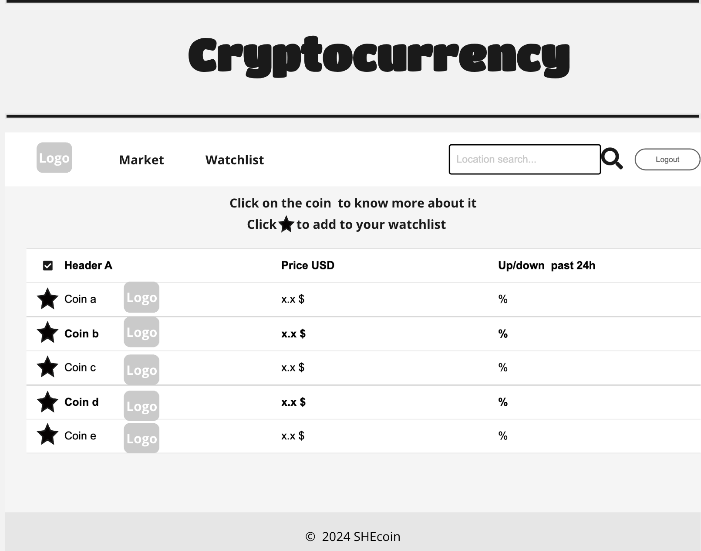

# SheCoin

## 1. Description & Context

### 1.1 Introduction

The project presented is a web application that displays cryptocurrencies and relevant information about the most significant cryptocurrencies according to their market capitalisation (calculated by multiplying the current price of a single unit of the cryptocurrency by the total number of units in circulation). Through this application, users will be able to view real-time market values of top cryptocurrencies, along with the percentage changes in trading activity over the past day.

This web application will provide users with a streamlined platform to track their favourite cryptocurrencies daily and access essential information to begin their investment journey.

### 1.2 Problems SheCoin will solve

Currently, many applications for monitoring cryptocurrency markets are cluttered with excessive information, making it difficult for users to make well-informed investment decisions. The presented application will address that issue, among others that the market faces, such as:

- Complexity: overcomplicated application can confuse and deter new users. This application aims to be simple and display only the necessary information that the user needs.

- Information overload: an excessive amount of information make it harder for the user to find relevant data, SheCoin will only display essential information and give the user the option to learn more about the cryptocurrency if desired.

- Personalisation: the web application presented gives the user the option to personalise their experience by creating an account, which will allow them to create their own list of cryptocurrencies for an easy tracking.

- Accessibility: traditional cryptocurrency applications can be intimidating for non-technical users. SheCoin has a user-friendly design that makes the platform accessible to a broader audience.

- Security: The presented application will provide users with an authentication system to ensure that only they are able to access their accounts.

### 1.3 Potential risks

While this application will solve numerous problems, it could also present some potential risks, as described bellow.

- Limited functionality: some users might not find the information they are looking for in the application, causing them to use another application.

- Market misinterpretation: providing only the top currencies in the market may lead to misinterpretation of market trends and conditions.

- Lack of differentiation: the presented application might not offer enough unique features to stand out and will have to add new features in the future to attract new users.

Being aware of the risks provides the team at SheCoin with a plan of action for future upgrades to the application.

### 1.4 Conclusion

Overall, while the proposed web application offers significant advantages such as accessibility, personalisation, and security, it is essential to acknowledge and address potential risks. By recognising these risks, the team at SheCoin can proactively plan for future upgrades, effectively navigate these challenges, and maintain its position as a user-friendly and reliable platform for cryptocurrency enthusiasts.

## 2. Features

The project propose will have the following features:

- Sign up service: users will be able to create an account to personalise their application.
- Login & logout: users will be able to access to their account and logout of it to protect their privacy.
- Display of cryptocurrency top coins: name, price and relevant data.
- Extra information on the coins: users will be able to select any coin to see more information about it.
- Favourite list: users will be able to add any coin to their favourite list so they can find and follow their favourites coins early.This feature will be construct with display to see the list, add option and delete option.
- Search coins: users will be able to look for any coin from a search bar.

## 3. User interface

The user interface will have a main screen displaying the top cryptocurrencies and some relevant information about them, a search bar to look for any desire coin and the possibility to click on them to see further information about it. The application will have a sign in and log in screen where users will be able to access to their accounts. For users log in the platform will have a favourite section where users will store and track their favourite coins.

[MiroBoard](https://miro.com/welcomeonboard/bVNnWnRuT3d2RHZwNTc1RjEyb1BhS21wa0FqdVFMVTFXcFpkaDVHRVR4NDNyT2RDODlMNTFGbUowTGs4RzBobXwzNDU4NzY0NTg1NjgzNjUzNzgwfDI=?share_link_id=702235744300)




The home page will display the top cryptocurrencies in the market, their price per unit, and the percentage increased/decreased of the price in the past 24h.


The more information page will display more information about the coin, including the price variance in the last 1h, last 24h and last 7d. The user will also be able to see the total volume in the market, the circulating supply and a chart with the latest prices variances.

## 4. Architecture


## 5. RESTful Routing

| Request Type | Request URL |      Payload      |         Response         |
| :----------: | :---------: | :---------------: | :----------------------: |
|     POST     |   /login    | {email, password} |       {token, id }       |
|     POST     |   /signup   | {email, password} |       {token, id}        |
|     GET      | /favourites |       {id}        |      {favourites[]}      |
|     POST     |    /add     |   {id,nameCoin}   | {favourites[], nameCoin} |
|     POST     |   /remove   |   {id,nameCoin}   |      {favourites[]}      |

## 6. Technologies & Deployment

### 6.1 Application:

- React vite
- Bootstrap
- Chart.js (to add the chart on the "more information" page)
- Node
- Node.js
- Express
- MongoDB

### 6.2 Testing:

- Jsdom
- Jest
- Vitest
- V8
- Chai
- Mocha
- Sinon
- Supertest

### 6.3 Deployment

- Netlify (front-end)
- Render (back-end)

\*\* The up to date information of cryptocurrencies will be supplied by an external API (http://www.coinmarketcap.com/api) in a json format like the sample bellow:

```json
{
	"data": [
		{
			"id": 1,
			"name": "Bitcoin",
			"symbol": "BTC",
			"slug": "bitcoin",
			"cmc_rank": 5,
			"num_market_pairs": 500,
			"circulating_supply": 16950100,
			"total_supply": 16950100,
			"max_supply": 21000000,
			"infinite_supply": false,
			"last_updated": "2018-06-02T22:51:28.209Z",
			"date_added": "2013-04-28T00:00:00.000Z",
			"tags": ["mineable"],
			"platform": null,
			"self_reported_circulating_supply": null,
			"self_reported_market_cap": null,
			"quote": {
				"USD": {
					"price": 9283.92,
					"volume_24h": 7155680000,
					"volume_change_24h": -0.152774,
					"percent_change_1h": -0.152774,
					"percent_change_24h": 0.518894,
					"percent_change_7d": 0.986573,
					"market_cap": 852164659250.2758,
					"market_cap_dominance": 51,
					"fully_diluted_market_cap": 952835089431.14,
					"last_updated": "2018-08-09T22:53:32.000Z"
				},
				"BTC": {
					"price": 1,
					"volume_24h": 772012,
					"volume_change_24h": 0,
					"percent_change_1h": 0,
					"percent_change_24h": 0,
					"percent_change_7d": 0,
					"market_cap": 17024600,
					"market_cap_dominance": 12,
					"fully_diluted_market_cap": 952835089431.14,
					"last_updated": "2018-08-09T22:53:32.000Z"
				}
			}
		}
	]
}
```
